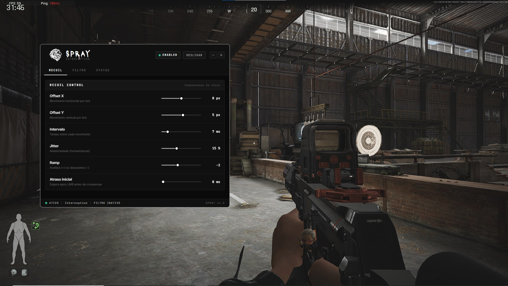

# SPRAY INTERCEPTION

> Utilitário de compensação de recoil para Windows — interface escura, HUD in-game e atualização automática.

[](https://github.com/T1NG4/TGS-SPRAY-interception-releases/releases/latest)
[](https://github.com/T1NG4/TGS-SPRAY-interception-releases/releases)
[]()



---

## O que é

O **SPRAY INTERCEPTION** é um aplicativo para Windows que aplica compensação de recoil no cursor, com movimento suave e humanizado. Não lê memória do jogo, não injeta código e não altera arquivos — só move o mouse via driver de input.

Recursos atuais (v1.5+):

- Compensação configurável (offset X/Y, intervalo, jitter, rampa, atraso, humanização)
- Biblioteca de armas com mira simples ou híbrida (1x / 2x / 3x / 3.5x / 4x)
- Recoil **Normal** ou **Advanced** por arma e por zoom
- Perfil com slots **primária / secundária** e binds no jogo
- Rapid Fire, lanterna automática e strobe
- HUD overlay in-game (posição arrastável)
- Filtro de processo, ADS (segurar ou alternar RMB) e hotkeys
- Conta com plano **Free** ou **Pro**
- Import/export de configs (Pro)
- Atualizações automáticas pelo GitHub Releases

---

## Planos

| | **Free** | **Pro** |
|---|---|---|
| Perfis | 1 | Ilimitados |
| Armas na biblioteca | 3 | Ilimitadas |
| Tempo de uso | 10 tokens/dia (tiro efetivo) | Ilimitado |
| Import / export de configs | Não | Sim |
| Presets | Não | Sim |

**Pro mensal:** R$ 19,90/mês  
**Pro anual:** R$ 179,10 (12 meses pelo preço de 9)

Pagamento **dentro do app**, com conta (email + senha). Hoje o checkout é **Bitcoin** (BlueWallet); o plano ativa sozinho após a confirmação on-chain. Pix volta em breve.

---

## Requisitos

- Windows 10 ou 11 (x64)
- Privilégios de Administrador (necessário para o driver de input)
- Driver Interception (o instalador e o próprio app cuidam disso)

---

## Download

Baixe a versão mais recente:

**[⬇ SPRAY INTERCEPTION Setup](https://github.com/T1NG4/TGS-SPRAY-interception-releases/releases/latest)**

Arquivo: `SPRAY-INTERCEPTION-Setup-x.x.x.exe`

---

## Instalação

1. Baixe o instalador na página de releases.
2. Execute como Administrador.
3. Siga as telas (pode escolher a pasta; padrão: `C:\Program Files\SPRAY INTERCEPTION`).
4. Ao concluir, marque **"Executar o SPRAY INTERCEPTION"**.

---

## Primeira execução

1. O app pede **login ou cadastro** (email + senha). Sem conta não entra na interface principal.
2. Na primeira vez, verifica e instala o driver **Interception**. Se o Windows pedir confirmação, aceite.
3. Se o driver pedir, **reinicie o PC** e abra o app de novo como Administrador.

Na aba **Misc** você pode ver o status do driver e **reinstalar** se algo falhar.

---

## Como usar

### Abas

| Aba | Função |
|-----|--------|
| **Recoil** | Parâmetros globais (offsets, intervalo, jitter, ramp, atraso, humanização) |
| **Perfil** | Primária/secundária, binds no jogo, recoil do perfil vs global, modo Advanced |
| **Armas** | Biblioteca: criar/editar armas, mira simples/híbrida, Rapid Fire, Advanced |
| **Misc** | Filtro de processo, driver, ADS, Rapid Fire padrão, lanterna, mira híbrida, posição da HUD, hotkeys |
| **Config** | Salvar/carregar configs; importar e exportar (Pro) |

### Controles padrão

| Ação | Atalho |
|------|--------|
| Ligar / Desligar | `INSERT` |
| Capturar janela em foco | `F8` |
| Selecionar arma primária | `1` (customizável no perfil) |
| Selecionar arma secundária | `2` (customizável no perfil) |

A HUD no canto da tela mostra o slot ativo e o zoom quando o compensador está ligado.

### Fluxo recomendado

1. Na aba **Misc**, defina o processo do jogo (ex.: `cs2.exe`) ou use `F8` com o jogo em foco.
2. Ajuste o recoil global na aba **Recoil**, ou ligue **Usar recoil do perfil**.
3. Crie armas na aba **Armas** (mira, zoom, Rapid Fire, Advanced se quiser).
4. No **Perfil**, encaixe primária e secundária e capture as teclas do jogo.
5. `INSERT` para ligar. A HUD confirma o slot ativo.

---

## Atualizações automáticas

O SPRAY INTERCEPTION verifica novas versões ao abrir. Se houver update, baixa e instala sozinho a partir deste repositório — não precisa baixar o setup de novo.

---

## Desinstalação

1. **Configurações → Aplicativos → Aplicativos instalados**
2. Procure **SPRAY INTERCEPTION**
3. **Desinstalar**

Para remover o driver (opcional):

```
install-interception.exe /uninstall
```

Reinicie o PC depois.

---

## Solução de problemas

### O app não abre / pede admin

- Execute como **Administrador**.
- Libere `SPRAY INTERCEPTION.exe` e `InputHostCore.exe` no antivírus.

### Backend offline / driver não sobe

- Abra de novo como Administrador.
- Em **Misc → Driver Interception**, clique em **Verificar** ou **Reinstalar**.
- Se pedir reboot, reinicie o PC.
- No prompt como Admin:
  ```
  sc query keyboard
  sc query mouse
  ```
  `RUNNING` = driver ativo.

### Recoil não compensa

- Confirme que está **ligado** (`INSERT`) e que a HUD aparece.
- Confira o processo na aba **Misc**.
- Se usar perfil, ligue **Usar recoil do perfil** e selecione as armas.
- Se **ADS** estiver ligado, segure ou alterne o RMB conforme o modo.

### Plano Free / Pro

- Cadastre-se e pague **dentro do app** (botão do plano no canto).
- Depois do pagamento Bitcoin, espere a confirmação na rede e clique em **Atualizar plano**.
- Free: 10 tokens/dia de tiro efetivo, 1 perfil e 3 armas.

---

## Aviso

Uso em jogos online competitivos pode violar os termos do jogo e resultar em banimento. Use por sua conta e risco. O software é fornecido para treino, PvE, servidores privados e acessibilidade — sem garantia de indetectabilidade.

---

## Licença

Uso pessoal. Termos completos aparecem no instalador.

---

## Contato

Bug ou sugestão? Abra uma issue neste repositório:

**[github.com/T1NG4/TGS-SPRAY-interception-releases/issues](https://github.com/T1NG4/TGS-SPRAY-interception-releases/issues)**
